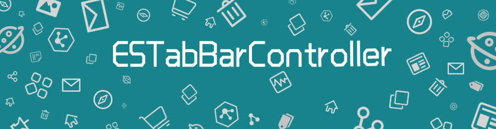

[](https://developer.apple.com/swift/)
[](https://github.com/theNightLight)

### [For English](README.md)

> **说明**：本项目为 [eggswift/ESTabBarController](https://github.com/eggswift/ESTabBarController) 的个人维护分支，主要新增 iOS 26 Liquid Glass 适配。**不提供 CocoaPods / Swift Package Manager 集成**，以免影响上游官方发布；请通过下载源码手动集成。

**ESTabBarController**是一个高度自定义的TabBarController组件，继承自UITabBarController。

本分支在 `ESTabBar` 上新增 iOS 26 布局相关属性，**默认开箱即用**：

- **`designType`**（默认 `.automatic`）：`.automatic` 随系统版本自动适配布局；`.old` 全版本强制使用传统 TabBar 布局（iOS 26+ 隐藏 platter、全宽均分）
- **`usesSystemGlassEffect`**（默认 `true`）：仅当 `designType == .automatic` 且在 iOS 26+ 生效；`true` 启用系统 Liquid Glass 双层嵌入，`false` 隐藏系统按钮、改用 `ESTabBarItemContainer` 全宽自定义布局

**默认效果**：不修改任何配置时，iOS 26 自动呈现系统玻璃 TabBar；iOS 26 以下与 upstream 一致，走传统布局。

### 为什么要使用?

在开发工作中，我们可能会遇到需要自定义UITabBar的情况。例如：改变文字样式、添加一些动画效果、设置一个比默认更大的样式等等，以上需求如果只通过UITabBarItem往往很难实现。

**有了ESTabBarController，你可以轻松地实现这些！**

-| 功能 |说明
-------------|-------------|-------------
1| 支持默认样式 | 如果直接使用ESTabBarController进行初始化，你会得到与UITabBarController完全相同的仿系统样式 </p> UITabBarController样式: </p>  </p> ESTabBarController仿系统样式: </p> 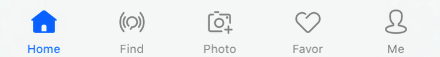
2| 支持带有"More"的默认样式 | 使用ESTabBarController进行初始化，若item大于最大显示数量则显示"More"，样式与UITabBarController一致 </p> 带有"More"的UITabBarController样式: </p> 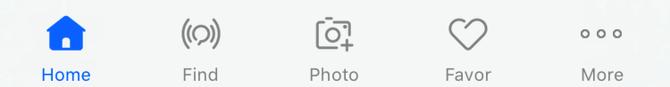 </p> 带有"More"的ESTabBarController样式: </p> 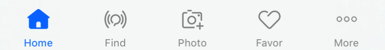
3| 支持UITabBarItem和ESTabBarItem混合 | 可以任意设置tabbar的items，支持即包含UITabBarItem，同时也包含ESTabBarItem </p> ESTabBar和UITabBar混合样式: </p> 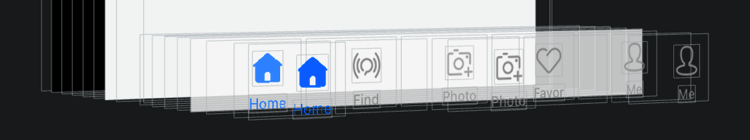 </p> 带有'More'的ESTabBar和UITabBar混合样式: </p> 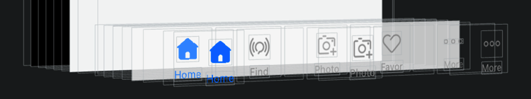
4| 支持UIKit属性 | 支持UITabBarController、UITabBar和UITabBarItem的大部分API属性，使原有代码无需任何修改即可无缝迁移到ESTabBarController </p> 支持UITabBarController的`selectedIndex`属性的实现: </p> 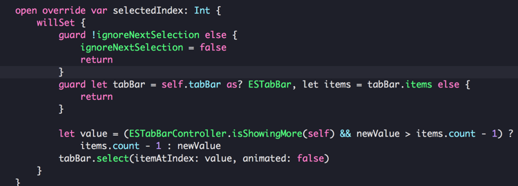
5| 支持与UINavigationController任意嵌套 | 通常在使用`UITabBarController`过程中，会存在两种比较常见的层级处理方式: </p> 第一种: </p> ├── UITabBarController </p> └──── UINavigationController </p> └────── UIViewController </p> └──────── SubviewControllers </p> 第二种: </p> ├── UINavigationController </p> └──── UITabBarController </p> └────── UIViewController </p> └──────── SubviewControllers </p> 第一种情况在push子视图的时候需要设置 `hidesBottomBarWhenPushed = true` , 第二种则不需要。 </p> 在ESTabBarController中，通过添加Container视图到UITabBar的方式来兼容这两种层级处理方式。
6| 支持自定义 | 使用ESTabBarController可以实现：</p> 1. 自定义选中颜色和样式 </p> 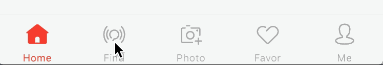 </p> 2. 添加选中时的动画效果 </p> 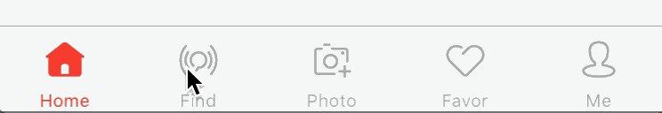 </p> 3. 自定义Item的背景颜色 </p> 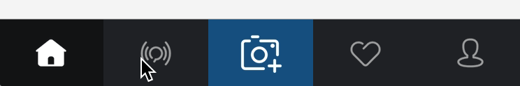 </p> 4. 添加高亮时的动画效果 </p> 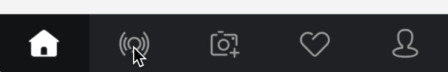 </p> 5. 添加一些动画暗示用户点击 </p> 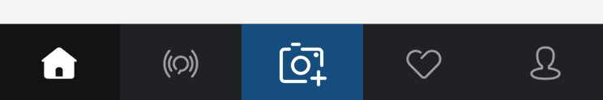 </p> 6. 等等...... </p>
7| 支持自定义按钮大小 </p> 支持自定义点击事件 | ESTabBarController支持自定义按钮的大小，你可以轻松定制不规则大小的tab按钮。</p> **当按钮frame大于TabBar时，通过HitTest方法使其超出TabBar区域点击仍然有效。** </p> 另外，ESTabBarController能够自定义点击事件，并通过一个block回调给上层处理。 </p> 中间带有较大按钮样式: </p> 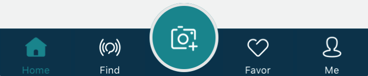 </p> 带有特殊提醒框样式: </p> 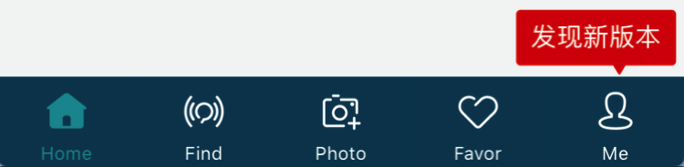 </p> 自定义按钮点击事件: </p> 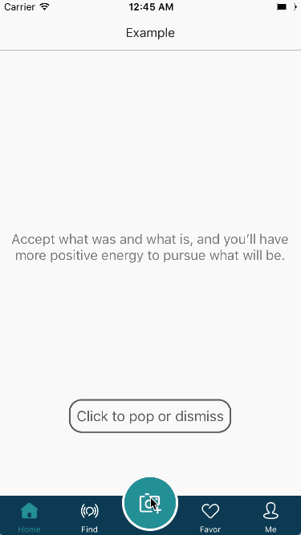
8| 支持默认通知样式 | 如果直接使用ESTabBarController进行初始化，你会得到与UITabBarController完全相同的仿系统通知样式 </p> UITabBarController样式: </p> 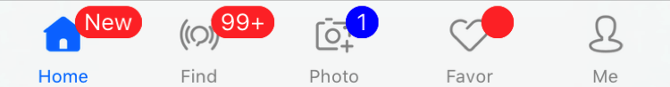 </p> ESTabBarController仿系统样式: </p> 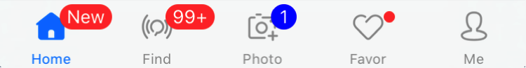
9| 支持自定义通知样式 | 使用ESTabBarController可以实现：</p> 1. 自定义提醒动画 </p> 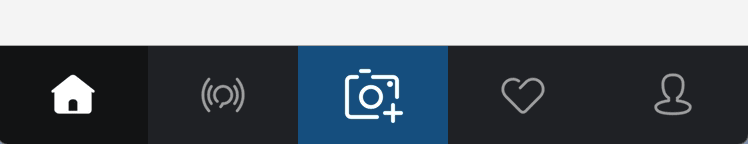 </p> 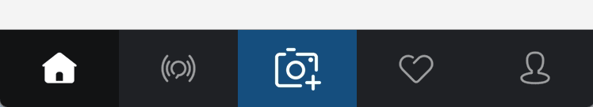 </p> 2. 自定义提醒样式 </p> 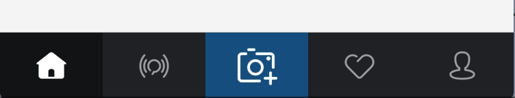 </p> 3. 等等...... </p>
10| 支持Lottie | 通过自定义ContentView，能够添加Lottie的LAAnimationView到Item </p> 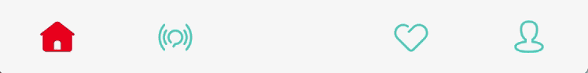
11| 支持 iOS 26 Liquid Glass 适配 | iOS 26 系统 TabBar 引入 Liquid Glass 效果。ESTabBarController 通过 `designType` 与 `usesSystemGlassEffect` 提供三种布局策略（需 iOS 26+）：</p> 1. **系统玻璃模式**（默认）：`designType = .automatic`，`usesSystemGlassEffect = true`。自定义 item 嵌入系统 `_UITabBarPlatterView` 双层结构，保留系统玻璃合成与选中动画。</p> 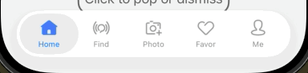 </p> 2. **自定义容器模式**：`designType = .automatic`，`usesSystemGlassEffect = false`。隐藏系统按钮，使用 `ESTabBarItemContainer` 全宽均分布局，适合完全自定义外观。</p> 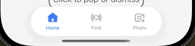 </p> 3. **强制旧版布局**：`designType = .old`。全版本走传统布局；iOS 26+ 隐藏 platter，Tab 项全宽均分，与 iOS 26 以下表现一致。</p> 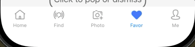 </p> 4. **系统玻璃 + Badge**：玻璃模式下未选中 item 显示 badge，选中项自动隐藏 badge。</p> 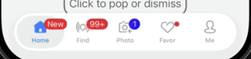

## 支持环境

* Xcode 8 or later
* iOS 8.0 or later（Liquid Glass 适配需 iOS 26.0+）
* ARC
* Swift 5 or later

## Demo

下载后运行 ESTabBarControllerExample 工程，你可以看到一些使用 ESTabBarController 实现的自定义 TabBar 的更多例子。Basic 分组中可体验上述 iOS 26 布局模式。

### iOS 26 Liquid Glass 配置

```swift
let tabBarController = ESTabBarController()
if let tabBar = tabBarController.tabBar as? ESTabBar {
    // 布局风格：.automatic（默认，随系统版本适配）或 .old（强制旧版）
    tabBar.designType = .automatic

    // 仅 designType == .automatic 且 iOS 26+ 有效
    // true：系统玻璃双层嵌入（默认）；false：自定义容器全宽布局
    tabBar.usesSystemGlassEffect = true
}
```

| 属性 | 默认值 | 说明 |
|------|--------|------|
| `designType` | `.automatic` | `.old` 时忽略 `usesSystemGlassEffect`，全版本走传统布局 |
| `usesSystemGlassEffect` | `true` | 仅 `.automatic` + iOS 26+ 生效 |

## 如何安装

本项目**仅支持源码下载 / 手动集成**，不使用 CocoaPods 与 Swift Package Manager。

### 下载源码

```bash
git clone https://github.com/theNightLight/ESTabBarController.git
cd ESTabBarController
open ESTabBarControllerExample/ESTabBarControllerExample.xcodeproj
```

### 集成到你的工程

1. 将 `ESTabBarControllerExample/ESTabBarControllerExample/Sources/` 目录下的 Swift 文件拖入你的 Xcode 工程。
2. 在需要使用的地方 `import` 对应模块（若作为 App Target 源码集成则无需额外 import）。
3. 将 `ESTabBarController` 作为根控制器使用，参考 Example 工程中的用法。

> 如需使用上游官方 CocoaPods / SPM，请访问 [eggswift/ESTabBarController](https://github.com/eggswift/ESTabBarController)。

## 未完成的事

1. Containers的布局方式目前是纯代码布局，使用Autolayout应该会更好。
2. 当存在"More"时，若进行Edit会出现问题。
3. UITabBarItem的部分属性还没有桥接到ESTabBarItem。
4. ~~ESTabBarItemMoreContentView中的"More"图片目前还未设置到framework中，计划将它转化为创建CGBitmap的代码。~~


## 赞助

如果这个项目对你有帮助，欢迎扫码支持：

| 支付宝 | 微信 |
|--------|------|
|  |  |


## 感谢

* [animated-tab-bar](https://github.com/Ramotion/animated-tab-bar) by <http://ramotion.com> 
* Example中部分图片资源来自 <http://www.iconfont.cn>


## 关于

本项目由 [haochen](https://github.com/theNightLight) 维护。如有问题或建议，欢迎提交 [Issue](https://github.com/theNightLight/ESTabBarController/issues) 或 [Pull Request](https://github.com/theNightLight/ESTabBarController/pulls)。

## 更新日志

详见 [CHANGELOG.md](CHANGELOG.md)。

## 许可证

The MIT License (MIT)

Copyright (c) 2013-2016 eggswift  
Copyright (c) 2026 haochen

完整许可证文本见 [LICENSE](LICENSE)。

## 原作者

本项目基于 [eggswift/ESTabBarController](https://github.com/eggswift/ESTabBarController) 修改。原作者：[eggswift](https://github.com/eggswift/ESTabBarController)

